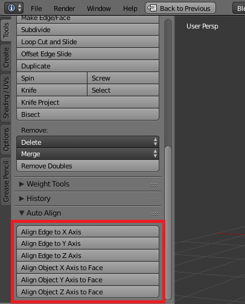
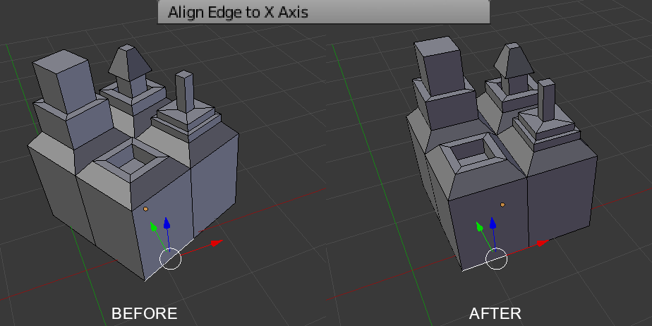
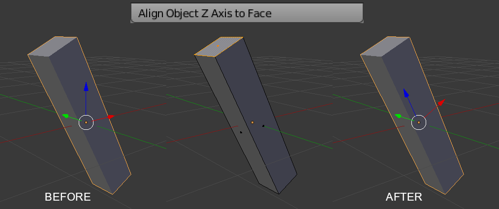
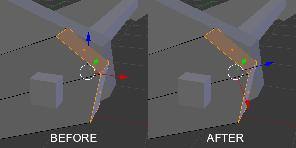

AlignTools
==========

A set of tools to easily align meshes to world axis or local object axis to mesh

Tools
-----

This add-on includes two utility operators, packed into a simple panel:

### Align Edge to X Axis

The object is rotated such that the selected edge aligns to a given global axis.

Usage: Select exactly one edge, then run the operator.

### Align Object X Axis to Face

The local axes of the object are aligned to the normal of the selected face. The mesh remains at the very same position.

Usage: Select one or many face, then run the operator.

When more than one face is selected, the average of the normals is used.

TODO
----

Some weird bugs occured when trying to make it undo-able, because it runs in edit mode but also affects the object transform. This is something to be address in order to make the operators take the axis as a property instead of building a whole operator for each axis.

History
-------

This add-on was originally written for my fellow students at "Arts et
Technologies de l'Image" (ATI, Universite Paris 8) when we had to struggle with
a scene made of blocks but where all the rotations had been applied.

Though less advanced, a version exists for Maya as well:
https://gist.github.com/eliemichel/db86f7a3ebd9f871628af4baf4dc2675

License
-------

Copyright (c) 2017-2018 Elie Michel

Permission is hereby granted, free of charge, to any person obtaining a copy
of this software and associated documentation files (the "Software"), to deal
in the Software without restriction, including without limitation the rights
to use, copy, modify, merge, publish, distribute, sublicense, and/or sell
copies of the Software, and to permit persons to whom the Software is
furnished to do so, subject to the following conditions:

The above copyright notice and this permission notice shall be included in all
copies or substantial portions of the Software.

THE SOFTWARE IS PROVIDED "AS IS", WITHOUT WARRANTY OF ANY KIND, EXPRESS OR
IMPLIED, INCLUDING BUT NOT LIMITED TO THE WARRANTIES OF MERCHANTABILITY,
FITNESS FOR A PARTICULAR PURPOSE AND NONINFRINGEMENT. IN NO EVENT SHALL THE
AUTHORS OR COPYRIGHT HOLDERS BE LIABLE FOR ANY CLAIM, DAMAGES OR OTHER
LIABILITY, WHETHER IN AN ACTION OF CONTRACT, TORT OR OTHERWISE, ARISING FROM,
OUT OF OR IN CONNECTION WITH THE SOFTWARE OR THE USE OR OTHER DEALINGS IN THE
SOFTWARE.
